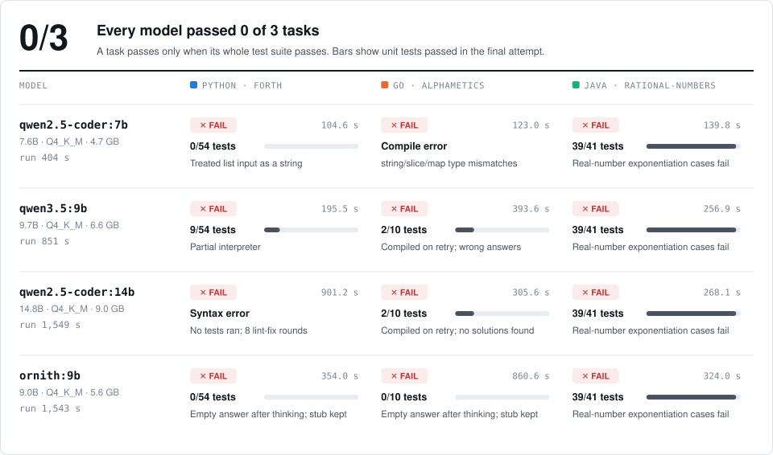
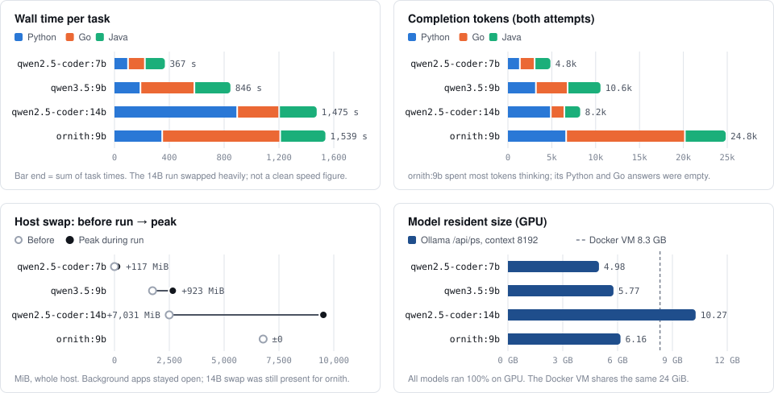

# local-llm-mac-benchmark

Reproducible experiments for local coding assistants on Apple Silicon, starting
with a **MacBook Air with 24 GB unified memory**, **Ollama**, and **Aider Polyglot**.
This repository stores methodology, configuration, scripts, raw outputs, and
summaries. Four three-task smoke runs completed on 2026-10-03:
[`qwen2.5-coder:7b`](docs/experiment-20261003-smoke.md),
[`qwen3.5:9b`](docs/experiment-20261003-qwen35-9b.md),
[`qwen2.5-coder:14b`](docs/experiment-20261003-qwen25-coder-14b.md) and
[`ornith:9b`](docs/experiment-20261003-ornith-9b.md), each with 0/3 tasks passed.
These validate the execution pipeline, not a representative model-quality estimate.

The goal is to make coding task success rate and system resource usage auditable
on an everyday laptop. Benchmark correctness, model quality, and hardware
performance are different questions; a pass rate does not measure intelligence.

## Results

Smoke runs on 2026-10-03: Apple M5 MacBook Air, 24 GiB, Ollama 0.35.1, Q4_K_M,
context 8192, requested temperature 0, whole-file edits, two attempts, one
worker. Every model got the same three tasks in the same order. Three tasks and
one run per model cannot rank these models.

<picture>
  <source media="(prefers-color-scheme: dark)" srcset="docs/figures/outcomes-dark.svg">
  
</picture>

<picture>
  <source media="(prefers-color-scheme: dark)" srcset="docs/figures/measurements-dark.svg">
  
</picture>

Experiment notes:
[`qwen2.5-coder:7b`](docs/experiment-20261003-smoke.md) ·
[`qwen3.5:9b`](docs/experiment-20261003-qwen35-9b.md) ·
[`qwen2.5-coder:14b`](docs/experiment-20261003-qwen25-coder-14b.md) ·
[`ornith:9b`](docs/experiment-20261003-ornith-9b.md)

<details>
<summary>Table view</summary>

| Model | Python `forth` | Go `alphametics` | Java `rational-numbers` | Run time |
| --- | --- | --- | --- | ---: |
| `qwen2.5-coder:7b` | ✗ 0/54 tests | ✗ compile error | ✗ 39/41 tests | 404 s |
| `qwen3.5:9b` | ✗ 9/54 tests | ✗ 2/10 tests | ✗ 39/41 tests | 851 s |
| `qwen2.5-coder:14b` | ✗ syntax error, no tests ran | ✗ 2/10 tests | ✗ 39/41 tests | 1,549 s |
| `ornith:9b` | ✗ no code applied (0/54) | ✗ no code applied (0/10) | ✗ 39/41 tests | 1,543 s |

| Model | Python | Go | Java | Completion tokens | Resident size | Swap before → peak |
| --- | ---: | ---: | ---: | ---: | ---: | ---: |
| `qwen2.5-coder:7b` | 104.6 s | 123.0 s | 139.8 s | 4,842 | 4.98 GB | 0 → 117 MiB |
| `qwen3.5:9b` | 195.5 s | 393.6 s | 256.9 s | 10,550 | 5.77 GB | 1,736 → 2,659 MiB |
| `qwen2.5-coder:14b` | 901.2 s | 305.6 s | 268.1 s | 8,232 | 10.27 GB | 2,496 → 9,527 MiB |
| `ornith:9b` | 354.0 s | 860.6 s | 324.0 s | 24,825 | 6.16 GB | 6,778 → 6,778 MiB |

Test counts are from the final attempt. Completion tokens are summed over both
attempts as recorded by Aider. Resident size is the GPU allocation from Ollama
`/api/ps`. Swap is a whole-host value, not model-only memory.

</details>

Figures are generated from saved metadata by `python3 scripts/render-figures.py`;
reviewed per-task notes live in [docs/figures/task-notes.json](docs/figures/task-notes.json).

### Reading these results

- **`ornith:9b` used up its context on reasoning.** For Python and Go, each
  response was about 7k tokens of thinking with an empty answer, so the stubs
  stayed unchanged. This run measures a thinking model at context 8192 more
  than its coding ability.
- **`qwen2.5-coder:14b` caused heavy swapping** (up to 9.5 GB) and two Ollama
  context shifts during the Python task, so its times are not clean speed
  measurements.
- Background applications were left open, and the 14B run's leftover swap was
  still present when `ornith:9b` started.
- All runs completed with exit code 0 and no unknown outcomes, test timeouts or
  task exceptions. Model digests, the task manifest, Docker image and adapter
  hash matched across runs. No generated code was repaired by hand.

Machine-readable results: [results/summary/results.csv](results/summary/results.csv)
and per-run JSON in [results/summary/](results/summary/).

## What runs where

```text
Mac host: orchestration + native stats → Ollama (local inference)
                  │                         ↑
                  └─ Docker: Aider harness ──┘
                              + generated code + exercise tests
                  ↓
       raw artifacts + metadata → standard-library CSV/JSON summaries
```

[Aider Polyglot](https://github.com/Aider-AI/aider/blob/5dc9490bb35f9729ef2c95d00a19ccd30c26339c/benchmark/README.md)
uses coding exercises across six languages. This runner selects **3 tasks by
default**, one at a time; it does not implicitly run the full suite.

Collected metrics: passed/failed/unknown tasks, complete-run and per-language pass
rates, task wall time, run wall time, sampled host memory/swap/CPU/load, and battery
endpoints. Tokens/sec, exact temperature, and watts are currently unsupported.
See [metric definitions](docs/metrics.md).

## Requirements

- Apple Silicon macOS, native arm64 Python **3.9+**, and Git.
- [Docker Desktop for Mac](https://docs.docker.com/desktop/setup/install/mac-install/),
  with its daemon running and sufficient VM memory/disk space for six language toolchains.
- [Ollama](https://ollama.com/download/mac) running **on the Mac**, with a locally
  installed model that fits alongside macOS and Docker. No model is downloaded by scripts.
- Internet access for source setup, the explicit image build, and potentially
  language-package downloads during exercise tests.

Host scripts use only Python's standard library and macOS tools. Aider and its
Python/language dependencies are installed inside the Docker image.

## Quick start

From a clone of this repository:

```bash
cp configs/benchmark.example.env configs/benchmark.env
# Edit MODEL_NAME to an exact installed Ollama name:tag (from `ollama list`).
# Select/pull a suitable model yourself if none is installed.
make setup        # clones only the two source repositories, at recorded SHAs
make build-image  # explicit, potentially large toolchain/dependency build
make doctor
make system-info
```

Start Docker Desktop and Ollama before `make doctor`. Local configuration is
parsed as `KEY=VALUE`, never sourced as shell code. Environment variables take
precedence. `BENCHMARK_CONFIG=/path/to/experiment.env` selects another config.
Model templates are standalone examples, not automatically merged.

The host uses `OLLAMA_BASE_URL=http://127.0.0.1:11434`; the container uses
`OLLAMA_DOCKER_BASE_URL=http://host.docker.internal:11434`. The runner checks that
the container can see the same model digest before starting tasks. If it cannot,
check Docker-to-host networking and the Ollama bind address. Follow the
[Ollama server configuration guide](https://docs.ollama.com/faq#how-do-i-configure-ollama-server).
Do not expose an unauthenticated Ollama endpoint to an untrusted network.
Use Ollama's local-only mode (`OLLAMA_NO_CLOUD=1` on the server) when supported.

## Start a three-task smoke test

After dependencies and the model are ready:

```bash
make smoke
make summarize
```

`make smoke` always forces `BENCHMARK_TEST_COUNT=3`. Direct invocation also defaults
to three, but honors an explicit count in your config or environment:

```bash
./scripts/run-aider.sh
BENCHMARK_TEST_COUNT=10 RUN_LABEL=ten-task ./scripts/run-aider.sh
```

Zero and negative counts are rejected. A smoke test validates the pipeline; three
tasks are not a representative model-quality estimate. Logs stream to files; use
`tail -f results/raw/<run-id>/stdout.log` in another terminal to watch progress.
Ctrl-C stops this run's container and saves partial metadata where possible.

## Artifacts and reproduction

```text
configs/dependencies.json              # exact source commit pins
results/raw/<run-id>/
  configuration.json, tasks.json       # effective settings and ordered task paths
  model-settings.yml, command.json     # temperature/context settings and command
  container-entry.py                   # exact adapter used
  python-packages.txt                  # image Python package inventory
  stdout.log, stderr.log, stats.csv
  aider/<language>/exercises/practice/<task>/
    .aider.results.json, .benchmark.timing.json, histories, generated files
metadata/runs/<run-id>.json             # extensible schema v1, state and observations
results/summary/results.csv            # one row per recorded run
results/summary/<run-id>.json           # task/per-language details, nulls preserved
```

Empty CSV cells mean unavailable, not zero. Incomplete tasks are unknown, not
failed. An overall pass rate is left empty until every selected task has a valid
outcome. See [schema](docs/metadata.md) and [methodology](docs/methodology.md).

To repeat a subset, restore the recorded non-secret settings and set:

```bash
TASK_MANIFEST=results/raw/<run-id>/tasks.json BENCHMARK_TEST_COUNT=3 \
  RUN_LABEL=repeat ./scripts/run-aider.sh
```

Use the original task count, model digest/quantization, source pins, and Docker
image ID. Commit your experiment configuration and repository code before formal
runs; an unborn Git repository has a null commit and a dirty checkout is flagged.
Pinning source does **not** freeze upstream package repositories. Preserve the
built image separately (`docker image save …`) for closer reproduction and record
its digest; large image archives are ignored. Identical outputs are not guaranteed
even at temperature zero. See [limitations](docs/limitations.md).

## Safety and publication

**The benchmark executes code generated by an LLM. Run it only in Docker/sandbox,
never directly on the host.** The runner mounts only the current run directory
writable and the exercises read-only; it does not mount your home, Docker socket,
or repository checkout, and does not forward API secrets. It drops Linux
capabilities, prevents privilege escalation, and limits memory/CPU/processes.
Docker is a risk reduction, not a security proof: the container has network
access, can contact Ollama, and can modify its own raw artifacts. Use a disposable
machine/VM for stronger isolation. Do not execute generated scripts on the host.

Review artifacts before committing: logs/generated text can contain arbitrary
content, and the requested hostname can be identifying. System collection omits
usernames, home paths, serial numbers and hardware UUIDs. Config/model weight/cache
files are ignored as appropriate; raw results, metadata and summaries remain
committable. Third-party exercise/code/model licenses still apply.

## Development and scope

`make check` performs shell syntax checks and isolated unit/integration tests;
tests use synthetic data only in temporary directories and never run a model.
Use `shellcheck scripts/*.sh` as an additional check if installed.

Shell entry points delegate to `scripts/benchmark.py` to avoid duplicate parsing
and metadata logic. `scripts/container-entry.py` adapts the pinned upstream
harness without modifying its source. Future `benchmarks/` and `runtimes/`
adapters can share the versioned metadata envelope; MLX, llama.cpp, LM Studio,
HumanEval, MBPP and SWE-bench are not implemented in this version.
